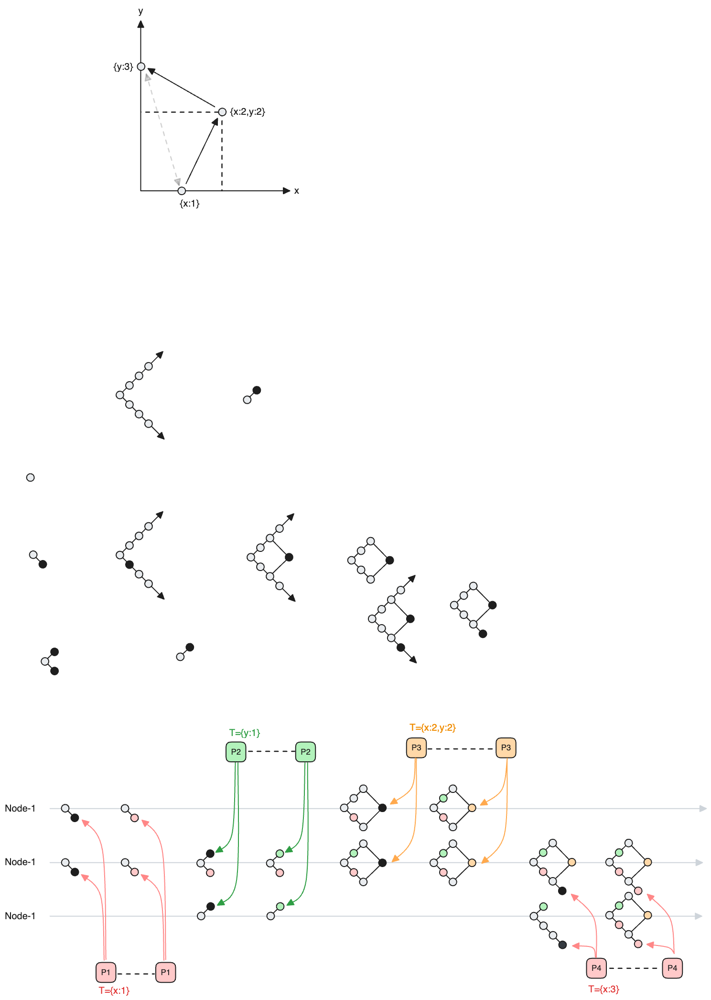

exmaple-crdt-define

这个虚拟时间的定义完整的描述了每个操作(Event) 之间的先后顺序, 所以我们只需把这个时间定义应用到我们的Abstract Paxos到这个系统, 就构建了一个满足这些顺序定义的分布式一致性协议, 而这个时间中允许不同key的并发的写入, 也就是说多个key的操作之间可以自由的互换顺序(commute), 于是我们就得到了一个CRDT: **conflict-free replicated data type**的分布式存储系统.

另外我们也看到它比平时我们所提的CRDT更加完整和健壮: 它不仅定义了哪些操作可以互换顺序, 也定义了包含同样key的2个操作必须保证顺序, 在一个朴素的CRDT中, 它可能需要引入分布式事务来解决这个问题, 而在我们的Abstract Paxos中, 它已经原生的提供了这种能力.